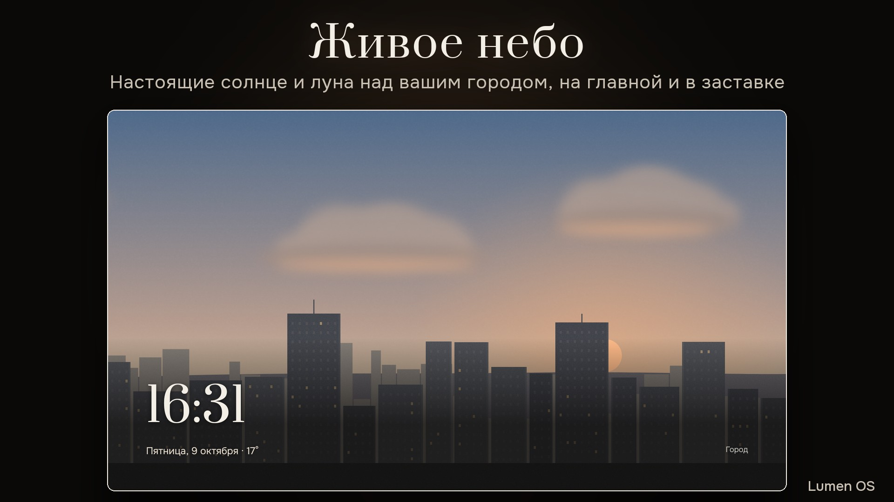
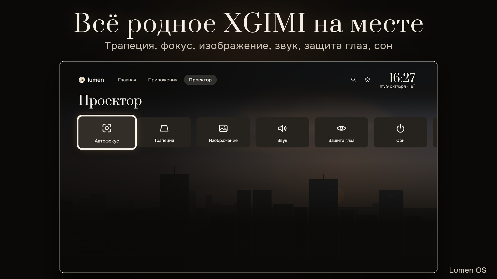
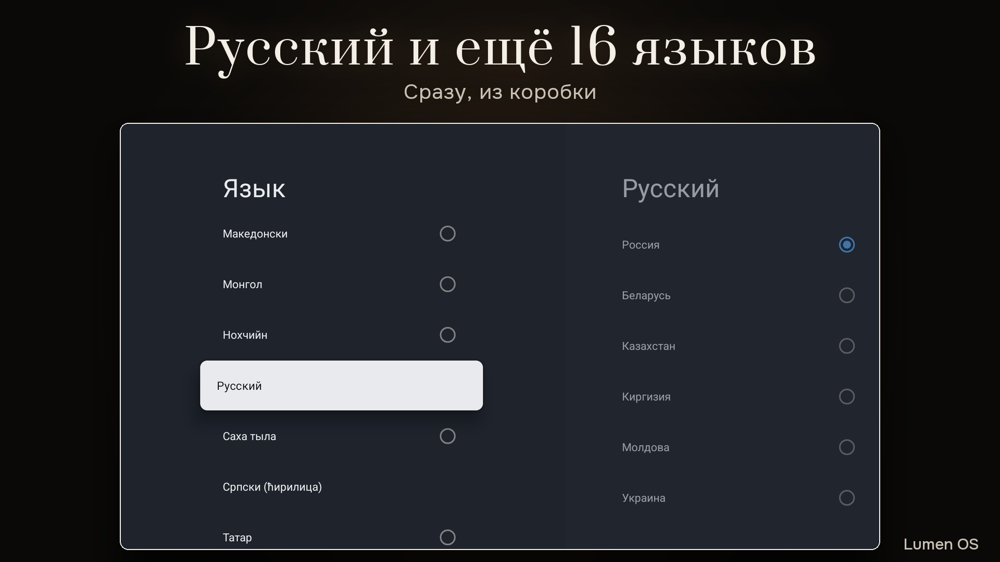
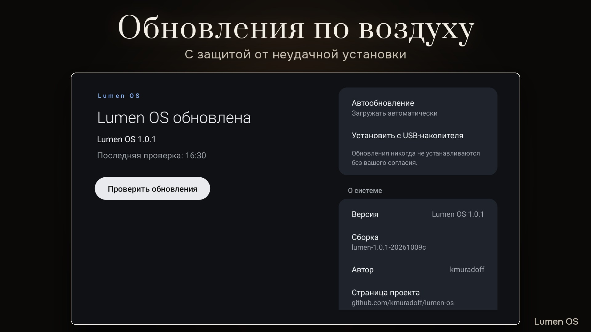

# Lumen OS

[English](README.md) | Русский

Android TV 14 для проектора XGIMI Z9X на основе LineageOS 21.

Состояние: версия 1.0.1, идёт тестирование.

<p>




</p>

## Что это

Lumen OS заменяет на Z9X только системный раздел. Прошивка XGIMI, boot, калибровка, лампа, фокус и
трапеция остаются как были, а приложения Lumen OS управляют ими через родную службу XGIMI. Интерфейс
работает в 1080p.

- Lumen Home: часы на фоне живого неба с настоящими солнцем и луной для вашего города (оно же
  заставка), погода, «Продолжить просмотр» из установленных приложений, все приложения с избранным и
  по алфавиту.
- Приложение «Проектор»: автофокус, ручная и автоматическая трапеция, режимы изображения и звука,
  защита глаз, сон, быстрая панель.
- Настоящий сон: лампа гаснет сразу, проектор засыпает. Пульт будит его в том же приложении.
- Приёмник AirPlay.
- 17 языков, русский в том числе. Пульт XGIMI подключается в первой настройке.
- Обновления по Wi-Fi, подписанные ключом проекта. Если новая версия не загрузится, проектор вернётся
  к прежней.
- «Установить с USB»: любой `.apk` с флешки прямо из Lumen Home.
- Нет рекламы и фоновых сервисов Google. В фоне держится не больше 10 приложений.

Аккаунт для Lumen OS не нужен, данные о вас не собираются. В сеть система ходит только за часовым
поясом и городом (ip-api.com без шифрования, ipapi.co или ipwho.is), погодой (Open-Meteo) и
обновлениями (GitHub).

## Без Google

В опубликованной версии нет приложений Google: Google Play, Chromecast built-in, голосового поиска
Google. Не запустятся приложения, которым нужны сервисы Google Play. Приложения ставятся с флешки или из
любого магазина, который вы выберете. Сервисы Google можно добавить самому одной командой установщика из
своего файла MindTheGapps, см. [«Как поставить сервисы Google»](docs/install/ru.md#google).

## Какие проекторы подходят

| Устройство | Код модели | Прошивка XGIMI | Состояние |
|---|---|---|---|
| XGIMI Z9X | G0082 | V6.15.58 или V6.15.19 | поддерживается |

## Установка

Нужны компьютер с macOS или Linux (или Windows, пока в бета-режиме), Android Platform-Tools 35 или
новее, кабель USB A–A в порт USB 2.0 проектора и один шаг vbmeta, который вы делаете руками.
Установка стирает все данные на проекторе.

- [Инструкция по установке](docs/install/ru.md)
- [Install guide (English)](docs/install/en.md)

Скачивайте только со [страницы релизов](https://github.com/kmuradoff/lumen-os/releases) этого
репозитория. В каждом релизе есть `SHA256SUMS` и `SHA256SUMS.sig`, установщик проверяет оба и другой
образ не примет. Копии на форумах и файлообменниках я не проверяю.

## Обновления и откат

Lumen OS обновляется по Wi-Fi: «Настройки → Настройки устройства → Об устройстве → Обновление Lumen OS».
Обновление ставится во второй слот, сохраняет данные и ждёт вашего согласия. Подробнее в разделе
[«Обновления»](docs/install/ru.md#updates), список изменений в [CHANGELOG.md](CHANGELOG.md).

Вернуться на родную прошивку можно официальной прошивкой XGIMI с флешки. Это стирает всё, см.
[«Откат на сток»](docs/install/ru.md#stock).

## Известные проблемы

- Установщик для Windows ещё не проверялся.
- Пока кабель USB подключён к компьютеру, проектор не засыпает по-настоящему. После установки
  отключите кабель.
- HDMI-CEC на Z9X не проверялся.
- Встроенная клавиатура печатает на английском. У поиска в Lumen Home своя клавиатура с кириллицей.
- Когда новая версия уже загрузилась, откатить обновление по воздуху нельзя.

## Помощь и сообщения об ошибках

Пишите в [тему XGIMI Z9X на 4PDA](https://4pda.to/forum/index.php?showtopic=1121837) или в
[issues на GitHub](https://github.com/kmuradoff/lumen-os/issues). Укажите версию прошивки XGIMI, версию
Lumen OS («Настройки → Настройки устройства → Об устройстве») и что вы делали перед проблемой, и
приложите весь текст из терминала.

## Плеер «Кино»

Видеоплеер, который я сделал для Lumen OS, лежит в отдельном репозитории:
[kmuradoff/kino-player](https://github.com/kmuradoff/kino-player).

## Сборка

Lumen OS собирается из TV GSI LineageOS 21, приложений Lumen OS (`apps/`), системных файлов (`system/`) и
инструментов для образа (`tools/`). Заметки для разработчиков лежат в [docs/dev](docs/dev/README.md).

```
git clone --recurse-submodules https://github.com/kmuradoff/lumen-os.git
```

## Благодарности

Спасибо проектам LineageOS, UxPlay, android-airplay-server и MindTheGapps, а также всем, кто
тестирует Lumen OS и пишет в теме на 4PDA.

## Поддержать проект

Lumen OS бесплатная, код открыт. Если она вам пригодилась, проект можно поддержать картой или криптой.

Картой (карты российских банков, СБП): [pay.cloudtips.ru/p/723aaba1](https://pay.cloudtips.ru/p/723aaba1)

| Сеть | Адрес | QR |
|---|---|---|
| USDT только в сети TRON (TRC20) | `TRjBAWuPa7WjdsATNkgwy955imhobH6sQV` |  |
| TON и USDT в сети TON | `UQA2yAApJyyZ_vOYwrM6E0K2hwmn_35Y7m68UbCN6Y_A1L6x` |  |

Проверьте сеть перед отправкой. USDT, отправленные на адрес TRON через другую сеть (ERC20, BEP20), пропадут.

Спасибо.

## Лицензия

Apache License 2.0, кроме `apps/Z9xAirPlay` (GPL-3.0-only) и сторонних подмодулей в `apps/third_party`
со своими лицензиями. Подробнее в [LICENSE](LICENSE) и [NOTICE](NOTICE). В репозитории нет приложений
Google, файлов MediaTek и XGIMI и ключей подписи.

Lumen OS я делаю сам. XGIMI, Google, MediaTek и LineageOS к ней отношения не имеют. Товарные знаки
XGIMI, Android, Google и LineageOS принадлежат их владельцам.
